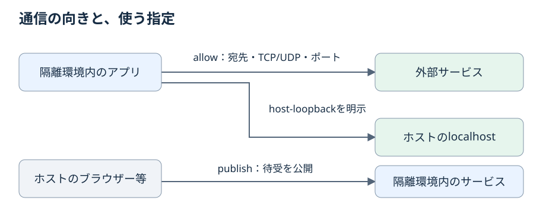

# ネットワークモード

`network.mode` で選ぶ 3 つのモード（`host`、`none`、`filtered`）が、隔離環境の通信をどこまで許すかを定める。
あわせて、モードを明示しなければならない場合と、使わないモードに残った通信許可や公開の指定の扱いを定める。
モードを選ぶとき、`host` や `none` から `filtered` へ移るとき、または起動前にモードに関わるエラーが出たときに読む。

## 3 つのモードの違い
<!-- @kotowari[REQ-388:3b1cde67, EX-716:bd237484, EX-717:b1b69fc1] -->

`host` と `none` は以前から提供するモードで、`filtered` は通信を許可した範囲に絞るために加えたモードである。

| モード | 隔離環境のネットワーク | 外部への通信 | 隔離環境内のループバック |
|---|---|---|---|
| `host` | ホストのネットワークをそのまま使う | ホストと同じに通る | ホストと同じ |
| `none` | ネットワーク名前空間を分離し、ループバックだけを残す | 経路が無く失敗する | 使える |
| `filtered` | 通信許可に一致する通信だけを通す | 許可に一致したものだけ通る | TCP と UDP の全ポートを使える |

`none` で起動したプログラムが `192.0.2.1` へ接続しようとしても、外部への経路が無いため接続できない。
`host` で起動したプログラムは、ホストと同じネットワークで動く。

`filtered` の許可の書き方は[通信許可](02-allow.md)、許可するアドレスの分類は[IP の入力と分類](03-addresses.md)、DNS 名から得た許可の扱いは [DNS 応答の検査と許可の寿命](04-dns.md)と[上流 DNS](05-dns-upstream.md)、ホストからの接続は[公開](06-publish.md)、プロセスの監督と障害時の扱いは [filtered のプロセス監督](07-lifecycle.md)で定める。

## filtered で使う 3 つの指定
<!-- @kotowari[REQ-001:4e682637] -->

`filtered` では、誰がどちらへ接続するかで指定を使い分ける。



| やりたいこと | 使う指定 | 章 |
|---|---|---|
| 隔離環境内のアプリから外部の API や IP へつなぐ | `[[network.allow]]` の `dns`、`ip`、`cidr` | [通信許可](02-allow.md) |
| 隔離環境内のアプリからホストの localhost のサービスへつなぐ | `[[network.allow]]` の `host-loopback` | [通信許可](02-allow.md) |
| ホストのブラウザーから隔離環境内の開発サーバーを開く | `[[network.publish]]` | [公開](06-publish.md) |

新規通信は、宛先、TCP/UDP、ポートがいずれかの有効な許可に一致するときに通り、どの有効な許可にも一致しなければ拒否される。
例外は 2 つある。
隔離環境内のループバック通信は TCP と UDP の全ポートを既定で許可する。
ただし、この例外でホスト側の localhost へ接続できるようにはならない。
もう 1 つは明示した待受の公開で、その範囲ではホストの localhost から隔離環境内のサービスへの接続を通す。

## filtered を選ぶ
<!-- @kotowari[REQ-082:43bf5293, EX-165:317592bf, EX-166:2238a332, EX-167:6c4c172c] -->

通信の制限は、`network.mode` に `filtered` を明示したときだけ有効になる。

```toml
[network]
mode = "filtered"

[[network.allow]]
destination = { dns = "api.example.com" }
protocol = "tcp"
ports = ["443"]
```

通信許可や公開を書いただけでは、モードは変わらない。
`mode = "host"` のポリシーに公開の指定を足しても、`filtered` に切り替わらず `host` のままである。
許可や公開を含まない既存のポリシーで `mode = "none"` と書いたものは、これまでどおり `none` として扱う。

## モードの明示が要る場合
<!-- @kotowari[REQ-087:d102c6c3, REQ-083:1cd4d747, REQ-399:a12cc88f, EX-169:53648c1f, EX-179:15688eff, EX-180:ccc92d7d, EX-181:75438030] -->

`filtered` とともに加えたネットワークのキー（`network.allow`、`network.publish`、補助のキー）を 1 つでも書いたら、`network.mode` の明示が要る。
値が空の配列でも、補助のキーだけでも同じである。
キーを書いた段と同じ段で明示しなくてもよく、他の段で明示したモードが合成の結果として採用されれば条件を満たす（段の合成は[ポリシーファイル](../05-policy.md)を参照）。

| 書いたもの | どの段にも `mode` が無い場合 |
|---|---|
| 空でない `network.allow` または `network.publish` | 起動前エラー（種類 `policy`）。アプリを実行しない |
| `network.publish = []` だけ | 起動前エラー（種類 `policy`） |
| `network.udp-idle-timeout-seconds = 120` だけ | 起動前エラー（種類 `policy`） |
| 加えたキーを何も書いていない | エラーにせず、`network.mode` の既定値 `host` を使う |

下の段に `mode = "filtered"` があり、上の段には `network.publish = []` だけを書いた場合は、明示の条件を満たす。

加えたキーを一切使わない既存のポリシーには、この条件を課さない。
どの段も `network.mode` を書いていなければ `host` になる（省略時のモードは[ポリシーファイル](../05-policy.md)を参照）。
加えたキーをどれかの段が書いていれば、この既定値は使わず、上の表のとおり種類 `policy` の診断で終わる。

## host と none に残った許可と公開
<!-- @kotowari[REQ-083:1cd4d747, REQ-084:a384542a, REQ-086:7492b82d, EX-168:af9c1123, EX-170:671ffe61, EX-172:5292db4d] -->

採用されたモードが明示された `host` または `none` なら、残っている通信許可や公開の指定を無視する旨を警告し、そのモードで起動する。
他の段から引き継いだモードも明示に含む。
たとえば `filtered` から `host` へ `mode` だけを書き換えた場合、許可の一覧を消さなくても `host` で起動する。
下の段で `mode = "none"` とし、上の段に公開の指定だけを書いた場合も、警告を出して `none` で起動する。
警告は `kakoi: warning: <説明>` の形の行で、診断ではない（[入れ子、並列、出力、診断と終了コード](../10-process.md)）。

ただし、使わない指定も入力の形は検査する。
次のどれかに当たれば起動前エラーになり、アプリを実行しない。

- 必須のキーが欠けている（例: 公開の指定に `host-ports` が無い）
- ポート番号が不正である（例: 通信許可の `ports` に `"65536"` がある）
- 公開の指定どうしが競合する（例: 同じ TCP 8000 番の公開先を 18000 番と 19000 番に指定した 2 つの公開がある。同じ TCP 8000 番と同じホスト側の範囲で、`host-family` だけが `ipv4` と `ipv6` に分かれた 2 つの公開がある）

一方、使わない指定のための環境の確認はしない。
DNS 名の問い合わせも、`host-interface` に書いたインターフェースが存在するかの確認も行わない。

公開の指定の書き方と競合の条件は[公開](06-publish.md)を参照。

## filtered の準備に失敗した場合
<!-- @kotowari[REQ-083:1cd4d747] -->

`filtered` の通信制限の準備に失敗しても、`host` へ自動で切り替えて起動することはない。
準備の失敗時の扱いは [filtered のプロセス監督](07-lifecycle.md)で定める。

## pasta が PATH に無い場合
<!-- @kotowari[REQ-429:4323f9b3, EX-824:332879e1, EX-825:7a383e6b, EX-839:4d2d0678] -->

`filtered` は pasta と nft をホストの `PATH` から探す。
pasta が見つからなければ、種類 `bwrap` の診断を出して終了コード 125 で終わり、アプリを実行しない。
診断の説明文は、pasta の導入手順の文書の URL "https://github.com/ba0918/kakoi/blob/main/docs/pasta.md" を含む。
URL を含まない診断は、この契約に反する。

pasta と nft がともに無いときは、pasta について報告する。
`--print-plan` は pasta の所在を確かめない。

## 必要なオプションを持たない pasta
<!-- @kotowari[REQ-430:7c94e3b7, EX-826:f47a3fc2, EX-827:f53cb09d, EX-828:d4fbef83, EX-840:bdaaa865, EX-841:1563b37e] -->

主要なディストリビューションの標準の pasta には、kakoi が渡すオプションを持たない古いものがある。
Ubuntu 24.04 の標準の pasta は `--host-lo-to-ns-lo` と `--map-host-loopback` を知らず、起動してすぐ使い方の文を出して終了する。

`filtered` の最初の起動で、準備完了の合図より前に pasta が終了したとき、kakoi は同じ pasta を `--help` 付きで実行する。
起動用のパイプが先に閉じた場合も、残りの起動の期限の中で pasta の終了を待ち、終了すればこの場合に含める。
待つ間も pasta の標準エラーを読み続ける。

`--help` の標準出力と標準エラーを合わせた出力に、確かめる名前がそれぞれ載っているかを調べる。
確かめる名前は、2 段の pasta に kakoi が `--` で始まる長い名前で渡すオプションのすべてで、pasta の引数を組み立てるときと同じ一覧から取る。
足りないと分かっていた 2 つに限らず、たとえば `--no-map-gw` だけが無い pasta も見分ける。
名前は、前後が空白、カンマ、行の端のどれかである出現だけを載っているとみなす。
`--host-lo-to-ns-lo-extra` は `--host-lo-to-ns-lo` を載せたことにならない。

載っていない名前が 1 つ以上あれば、種類 `bwrap` の診断を出して終了コード 125 で終わる。
説明文は、載っていない名前のすべてと導入手順の文書の URL を含み、pasta の出力（知らないオプションへの苦情や使い方の文）を含まない。

```
kakoi: bwrap: /usr/bin/pasta is too old for filtered network mode: it lacks --host-lo-to-ns-lo, --map-host-loopback; see https://github.com/ba0918/kakoi/blob/main/docs/pasta.md
```

## 古さ以外で終了した pasta
<!-- @kotowari[REQ-432:f300696e, EX-831:19bd9e45, EX-832:6f3d32f9, EX-844:e33dbb6b, EX-845:712c9de5] -->

次の場合は古いと決めつけず、種類 `bwrap` の診断に pasta が終了時に出した理由を付けて、終了コード 125 で終わる。
この診断は導入手順の文書へ案内しない。

| `--help` 付きの実行 | 例 |
|---|---|
| 実行できなかった | — |
| 残りの起動の期限を過ぎても終わらなかった | 何も出さずに動き続ける。起動の期限を過ぎたところで診断を出す |
| 標準出力と標準エラーを合わせた出力が空だった | 何も出さずに 0 で終わる |
| 確かめる名前がすべて載っていた | 権限の不足など古さ以外の理由で起動に失敗した |

`--help` 付きの実行の終了コードでは判定しない。
名前がすべて載った使い方を出して 1 で終わる pasta も、古いとはみなさない。

## 古さを確かめない場合
<!-- @kotowari[REQ-431:a5dff52d, EX-829:acb3e438, EX-830:49c9690d, EX-842:85b64bc2, EX-843:d9f1b149] -->

kakoi は次の場合に pasta を `--help` 付きで実行しない。

- `filtered` の起動で pasta が起動に成功したとき（その後の成否は問わない）。
- pasta の起動がタイムアウト、PID の不正、取り消しで終わったとき。
- 起動用のパイプが閉じた後、残りの起動の期限までに pasta が終了しなかったとき。
- 通信障害から立ち直るときの pasta の再起動が失敗したとき（[filtered のプロセス監督](07-lifecycle.md)）。
- `--print-plan` のとき。計画の表示は pasta を呼ばない。

起動に成功した pasta に `--help` を求めることは、この契約に反する。

## pasta の探し方
<!-- @kotowari[REQ-433:bf624806, EX-833:d77e8688, EX-834:6c6848d3] -->

kakoi は pasta をホストの `PATH` だけから探す。
ポリシーにも環境変数にも、pasta の場所を指定する項目は無い。
そうした項目を持つことは、この契約に反する。

新しい pasta を使うには、`PATH` で古い pasta より前に来る場所に置く。
たとえば `~/.local/bin` の新しい pasta が `PATH` で `/usr/bin` より前に来れば、kakoi は `~/.local/bin` の pasta を起動する。

## 許可も公開も空の filtered
<!-- @kotowari[REQ-085:61b5a958, EX-175:114921ef, EX-176:e01d9f35] -->

`filtered` で通信許可と公開がどちらも空か未指定でも、有効なポリシーとして起動する。

```toml
[network]
mode = "filtered"
```

この場合、アプリの外部への通信、ホストへの接続、待受の公開はどれも許可されない。
隔離環境内のループバックは使えるので、同じ隔離環境内の別の処理とは通信できる。

## 起動後に許可が増えない理由
<!-- @kotowari[REQ-029:8fbf3e65, REQ-028:8db778d5, EX-047:4e2e0e4f, EX-048:e10bd8cf, EX-049:93c81711, EX-050:f661089a] -->

許可の正本は、起動時に確定したポリシーである。
アプリが新しい宛先やポートを許可してほしいと申告しても、ポリシーは変わらず、広がりもしない。

DNS 応答は、許可済みの名前が今どの IP を指すかを知るための入力として扱い、許可のルールそのものを足す根拠にはしない。
DNS 名から IP の許可を作れるのは、kakoi が管理する DNS の経路で送った問い合わせと対応を確かめられた上流の応答だけである。
アプリが別の経路で得た名前と IP の対応や、アプリが申告した IP からは許可を足さない。

そうした IP への通信は、既存の有効な IP とポートの許可だけで判定する。

| アプリが別の経路で得た IP とポート | 新規通信 |
|---|---|
| 有効な許可がある | 許可されたトランスポートなら通る |
| 有効な許可が無い | 拒否される |

応答の検査と、DNS から得た許可がいつまで有効かは [DNS 応答の検査と許可の寿命](04-dns.md)で定める。

## モードに関わるエラー
<!-- @kotowari[REQ-084:a384542a, REQ-086:7492b82d, EX-171:00b16a66, EX-177:c66e390e, EX-178:71f31d32] -->

この章の規則で起動前に止まる場合をまとめる。

| 条件 | 結果 |
|---|---|
| どの段にも `mode` が無く、加えたネットワークのキーを書いている | 起動前エラー |
| モードを問わず、許可や公開に必須のキーが欠けている | 起動前エラー |
| モードを問わず、ポートの書き方が不正である | 起動前エラー |
| モードを問わず、公開の指定どうしが競合する | 起動前エラー |
| 明示した `host` または `none` に、形の正しい許可や公開が残っている | 警告を出して起動する |

### 診断の種類と終了コード
<!-- @kotowari[REQ-426:13163061, REQ-427:3edc0e4f, EX-818:fdd37397, EX-819:2ee4dd22, EX-821:e6a64fb3] -->

`filtered` のネットワークの入力の誤りは、誤りを見つけた場所によって診断の種類が分かれる。
どちらの種類でも終了コードは 125 で、アプリは起動しない（診断の形は[入れ子、並列、出力、診断と終了コード](../10-process.md)）。

| 誤りを見つけた場所 | 原因 | 診断の種類 | 終了コード |
|---|---|---|---|
| ポリシーファイルの読み込みと段の合成 | ポリシー | `policy` | 125 |
| `filtered` の起動の処理 | ホストの環境 | `bwrap` | 125 |

段の合成で初めて見つかる誤りも `policy` になる。
例えば下の段に `"plain"` の上流 DNS だけ、上の段に `"tls"` の上流 DNS だけがあれば、1 つのファイルの中では混在していなくても、合成した一覧の混在として `policy` の診断になる（上流 DNS の書き方は[上流 DNS](05-dns-upstream.md)）。

`filtered` の起動の処理で見つかる誤りは、ホストの環境が原因のものである。
DNS 名の許可を使いホスト DNS を選んだときに、ホストの名前解決設定に `nameserver` が無い場合がこれに当たる（[上流 DNS](05-dns-upstream.md)）。
ポリシーを直しても解決しないので、ポリシーの誤りの `policy` と分けている。
ホストの非ループバック IP への到達経路は実証が済んでいない（[未決事項](../../appendix/open-issues.md)）。

### host-interface を含む宛先の拒否
<!-- @kotowari[REQ-428:1d60dcb7, EX-820:02cbf9ea, EX-822:f5c6374d, EX-823:7f3bf121] -->

初版の `filtered` は、IPv6 リンクローカル宛先への許可を提供しない（[IP アドレス](03-addresses.md)）。
合成後のモードが `filtered` で、通信許可に `host-interface` を含む宛先があれば、ポリシーの合成の段階で拒否し、`policy` の診断を出して終了コード 125 で終わる。
`--print-plan` でも計画を表示せず、同じ診断で終わる。
合成後のモードが `host` か `none` なら、使わない指定として形だけを検査して通す。

