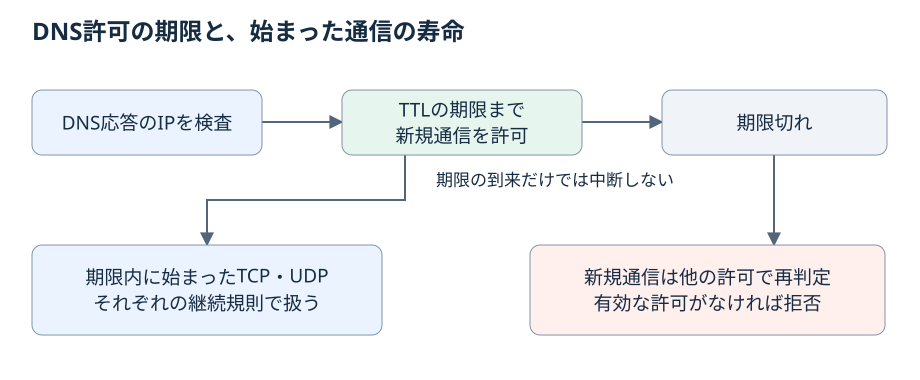

# DNS 応答の検査と許可の寿命

filtered モードで、許可した DNS 名がどのように IP の通信許可へ変わり、その許可がいつまで続くかを決める章である。
応答に許可できない IP が混ざった場合の扱い、TTL と許可の期限、期限が切れた後の TCP と UDP、アプリへ返す失敗応答の種類もここで扱う。
DNS 名の書き方は [通信許可](02-allow.md)、上流 DNS の指定と処理の上限は [上流 DNS](05-dns-upstream.md) を参照する。

この章の内容は草案であり、実装前に実証の完了条件（[ライブラリの責務と実証条件](../../maintainer/library.md)）を満たす必要がある。

## DNS 名が許可に変わるまで
<!-- @kotowari[REQ-027:da4118db, REQ-024:184dc0b8, REQ-014:fe49f325] -->

kakoi-net は、隔離環境のアプリが使う DNS の経路を管理する（以下、**管理する DNS 経路**）。
許可した名前の解決結果でも、返された IP を無条件には通さない。
問い合わせとの対応、別名（CNAME）の参照、アドレスの制限を確かめてから、IP とポートの許可を作る。

流れは次の 4 つの段階である。

1. アプリの問い合わせ名が許可ルールに一致するかを確かめ、一致しなければ上流へ送らない。
2. 上流 DNS に問い合わせる。
3. 応答を検査する（CNAME を辿った最終 IP だけを候補にし、許可できない IP の扱いを決める）。
4. 検査を通った IP に、TTL から決まる期限つきの通信許可を作り、アプリへ応答を返す。

### 上流へ送る問い合わせ
<!-- @kotowari[REQ-027:da4118db, EX-044:b97521fd, EX-045:68447c70, EX-046:5837d0cb] -->

管理する DNS 経路は、許可ルールに一致する名前の問い合わせだけを上流へ送る。
それ以外の名前の問い合わせは上流へ送らず拒否する（応答は [REFUSED](#失敗応答の使い分け)）。
許可した名前から CNAME で辿る参照先は、参照先の名前を別に許可しなくても問い合わせる。

| 問い合わせ名 | 扱い |
|---|---|
| 許可ルールに一致する名前 | 上流へ送る |
| 許可した名前から CNAME で辿った参照先 | 追加の許可なしで上流へ送る |
| 上のどちらでもない名前 | 上流へ送らず拒否する |

例: 許可した名前が `api.example.com` だけのとき、`other.example.net` の問い合わせは上流へ送られない。
`api.example.com` の CNAME が `edge.example.net` を指していれば、`edge.example.net` の問い合わせは認められる。

### 上流 DNS の既定と名前別の振り分け
<!-- @kotowari[REQ-026:cc404f40, REQ-106:4d2eafd4, EX-042:e19a9cbd, EX-043:1a0c2aa3, EX-230:752769ea, EX-231:b59c2e94] -->

上流 DNS は、既定ではホストの DNS 設定を使う。
ポリシーで問い合わせ先を指定すれば、そちらを使う（指定の書き方は [上流 DNS](05-dns-upstream.md)）。

上流を明示せずホストの DNS 設定を使う場合は、名前ごとに問い合わせ先を分けるホストの設定も引き継ぐ。
例えば、ホストが社内名を社内の DNS へ、一般名を別の DNS へ振り分けているなら、許可済みの社内名と一般名はそれぞれの問い合わせ先へ送られる。

振り分けを引き継いでも、上流へ送る名前の範囲は変わらない。
ホストに社内名の問い合わせ先が設定されていても、その名前が許可ルールに一致せず、許可名からの CNAME 参照先でもなければ、上流へ送らず拒否する。

### 署名検証の担当
<!-- @kotowari[REQ-025:eb0e8ec1] -->

DNSSEC の署名検証は、設定された上流 DNS に任せる。
kakoi-net 自身は暗号学的な署名検証を行わず、IP とポートの許可判定を担当する。

このため、DNSSEC による保証は上流の検証設定と、上流までの通信経路に依存する。
検証をしない上流を使う場合、DNSSEC の保証は無い。

## 応答の検査
<!-- @kotowari[REQ-019:24f6a84e, REQ-023:02998f2d, REQ-020:21c68385] -->

上流から得た応答は、許可を作る前に次の 3 つの点で検査する。
CNAME を辿った最終 IP であること、CNAME の解決が完了したこと、IP が許可できるアドレスであることである。

### CNAME を辿る
<!-- @kotowari[REQ-019:24f6a84e, REQ-024:184dc0b8, EX-030:2d04b7f1, EX-041:aebbfe12] -->

許可した DNS 名が CNAME で別の名前を指している場合、参照先の名前を別に指定しなくても最後まで辿り、最終 IP を検査する。
その最終 IP に許可するプロトコル（TCP、UDP）とポートは、元のルールの範囲に限る。

許可の候補にするのは、問い合わせた許可名から辿れる最終 IP だけである。
同じ応答に、参照経路と無関係な名前の IP が同梱されていても、その応答を根拠とした許可には加えない。

### CNAME の解決が完了しないとき
<!-- @kotowari[REQ-023:02998f2d, EX-038:e8e4448c, EX-039:20588a2f, EX-040:98da1056] -->

次のどれかに当たると、名前解決を失敗させる（応答は [SERVFAIL](#失敗応答の使い分け)）。

- CNAME が循環している（名前 A が名前 B を指し、名前 B が名前 A を指す）。
- CNAME の参照回数の上限を超えた。
- 解決時間の上限を超えた。

途中まで辿った不完全な結果から、新しい IP 許可は作らない。
参照回数と解決時間の上限値は [上流 DNS](05-dns-upstream.md) で扱う。

### 許可できない IP が混ざった応答
<!-- @kotowari[REQ-020:21c68385, EX-031:81bc058a, EX-032:be2a5b9d, EX-033:20b35958] -->

応答に、許可できる IP と許可できない IP（別に明示許可していない内部 IP）が混ざっている場合の扱いは、応答が署名付きかどうかで分かれる。

| 応答 | 扱い |
|---|---|
| 署名なしの混在応答 | 許可できる IP だけを残してアプリへ返す。許可できない IP は応答から除く |
| 署名付きの混在応答 | 応答を加工せずにアプリへ返す。アプリが許可できない IP へ新規通信を試みると、その通信を拒否する |

署名付きの応答は、書き換えると署名が合わなくなる。
そのため応答はそのまま渡し、禁止 IP への通信は通信の段階で止める。
IP の分類（どのアドレスが内部 IP か）は [IP の分類](03-addresses.md) を参照する。

### 全 IP が禁止の応答
<!-- @kotowari[REQ-021:9505d790, EX-034:f8df7671, EX-035:9f74d007] -->

応答で返された IP のうち、許可できる IP が 1 つもない場合は、ポリシーによる拒否として名前解決を失敗させる（応答は [REFUSED](#失敗応答の使い分け)）。
署名付きの応答でも同じで、応答全体を拒否する。
IP をすべて取り除いた成功応答を返すことはしない。

この規則が対象にするのは、IP を含む応答で、その全候補が禁止だった場合である。

| 応答中の IP | 署名なし | 署名付き |
|---|---|---|
| 許可できる IP と禁止 IP が混在 | 許可できる IP だけを返す | 加工せず返し、通信時に禁止 IP を拒否する |
| 全 IP が禁止 | 名前解決を拒否する | 名前解決を拒否する |

## 許可の寿命
<!-- @kotowari[REQ-014:fe49f325, REQ-015:d4fa8f1a, REQ-016:e2ccb607] -->

DNS の応答には TTL という有効期間がある。
kakoi-net は、この期限に合わせて新規通信の許可を管理する。
許可の期限と、すでに始まった通信の寿命は分けて扱う。



### 既定値と範囲
<!-- @kotowari[REQ-093:ff8806a8, REQ-389:6e244e0d, REQ-134:55410925] -->

この節の数値を 1 つの表にまとめる。
各項目の規則は、表の後の節で説明する。

| 項目 | ポリシーのキー | 既定値 | 指定できる範囲 |
|---|---|---|---|
| TTL ゼロの猶予 | `network.dns-zero-ttl-grace-milliseconds` | 1000 ミリ秒 | 100〜10000 の整数ミリ秒 |
| UDP の無通信期限 | `network.udp-idle-timeout-seconds` | 120 秒 | 1〜86400 の整数秒（0 と無制限は不可） |
| 解決失敗の保持時間 | 未決（[未決事項](../../appendix/open-issues.md)） | 5 秒 | 1〜300 秒 |

TTL ゼロの猶予と UDP の無通信期限は、範囲の外の値を拒否する。

### TTL に連動する許可
<!-- @kotowari[REQ-014:fe49f325, EX-023:91cf7769, EX-024:b16e2b71] -->

DNS 応答から得た IP は、検査を通ってから TTL の期間だけ新規通信を許可する。
新しい応答を得たら再検査して許可を更新するので、利用者が解決先 IP を追いかけてポリシーを書き換える必要はない。

許可を更新できずに期限が切れた IP への新規通信は、他に有効な許可が無ければ拒否する。
他に有効な許可があれば、その許可によって通信できる。
TTL が 0 の応答には、[TTL ゼロの猶予](#ttl-ゼロの猶予) を適用する。

### 許可は期限より後に切れない
<!-- @kotowari[REQ-397:6adfab5c, EX-733:e6a358bf] -->

DNS 由来の許可は、応答の受信と TTL から決まる期限より後まで、カーネルに残さない。
許可はカーネルに残り時間で登録するため、登録にかかる時間を見込んだ分だけ、期限より早く失効することはある。

登録が見込んだ時間を超えて遅れ、見込む時間を延ばして登録し直す場合も、カーネルの許可は期限までに失効する。

### CNAME を経由した許可の期限
<!-- @kotowari[REQ-022:a53a1235, EX-036:8d2eb5d5, EX-037:a7f2b8e7] -->

CNAME を辿って作った新規通信の許可の期限は、参照経路上の CNAME と最終 IP の情報のうち、最も早く失効する時点である。
別名の情報だけが先に切れる場合も、その時点で期限になる。

| CNAME の残り | 最終 IP の残り | 許可の期限 |
|---|---|---|
| 60 秒 | 300 秒 | 60 秒後 |
| 300 秒 | 60 秒 | 60 秒後 |

経路上に TTL が 0 の情報がある場合は、その情報にだけ [TTL ゼロの猶予](#ttl-ゼロの猶予) を適用し、正の TTL の期限は延ばさない。

### TTL ゼロの猶予
<!-- @kotowari[REQ-389:6e244e0d, EX-718:aeadf7ed, EX-719:25bdab8d, EX-720:ec626168, EX-721:fca198e2] -->

TTL が 0 の応答で検査を通った IP にも、接続を始めるための猶予を設ける。
猶予は応答の受信から数え、既定は 1000 ミリ秒である。

| キー | 型 | 既定値 | 範囲 |
|---|---|---|---|
| `network.dns-zero-ttl-grace-milliseconds` | 整数（ミリ秒） | 1000 | 100〜10000 |

段の合成では、上の段の明示した値を優先し、省略した段は下の段の値を引き継ぐ（段については [ポリシーファイル](../05-policy.md)）。
99 や 10001 のような範囲外の値は拒否される。

猶予の数え方には次の規則がある。

- 起点は応答の受信時点である。受信から 300 ミリ秒後に検査が終わっても、既定なら期限は受信から 1000 ミリ秒後のままである。
- 期限を過ぎてから許可の登録が終わった候補は、新規通信の許可として有効にしない。
- 許可を更新するのは、新たに検査を通った応答を得たときだけである。通信が続いていても猶予は延びない。
- TTL が 0 の応答を、後の問い合わせへの回答に再利用しない。
- CNAME の経路では、TTL が 0 の情報にだけ猶予を適用し、各情報の失効時点のうち最も早いものを期限にする。正の TTL の失効を猶予で延ばさない。

猶予の間に始まった TCP と UDP には、[期限が切れた後の TCP](#期限が切れた後の-tcp) と [期限が切れた後の UDP](#期限が切れた後の-udp) の継続規則を適用する。
そのため、通信全体が猶予の長さで止まるわけではない。
猶予が切れ、他に有効な許可が無ければ、既存の通信が続いていても別の新規通信は拒否される。

### アプリへ返す TTL
<!-- @kotowari[REQ-398:8d3c1648, EX-734:b89ae834, EX-735:10313912] -->

アドレスの問い合わせへの応答をアプリへ返すとき、回答部の各レコードの TTL を、その応答の回答部で最も短い TTL に揃える。
許可の期限はこの最短の TTL から決まるので、アプリが許可より長く有効だと思って古い IP を持ち続けないようにするためである。

| 上流の応答 | アプリが受け取る TTL |
|---|---|
| 許可された 2 つの IP が TTL 30 秒と 300 秒 | どちらも 30 秒以下 |
| 別名の TTL が 10 秒、最終 IP の TTL が 300 秒 | 最終 IP は 10 秒以下 |

メッセージ署名付きの応答は書き換えず、元の TTL のまま返す。

### 情報を更新する契機
<!-- @kotowari[REQ-133:d88c6206, EX-299:387962d0, EX-300:66267b64] -->

DNS の情報は、アプリからの問い合わせを契機に解決する。
有効なキャッシュがあればそれを使い、期限が切れた後の次の問い合わせで取得し直す。
問い合わせの無い名前を、定期的に先読みして更新することはしない。

古い応答による IP の許可は、元の期限まで残る。
新しい応答が別の IP だけを返しても、旧 IP の許可は取り消されない。

アプリが古い IP だけを持ち続けて名前を問い合わせ直さない場合、許可の期限の後の新規接続は拒否されることがある。

### 期限が切れた後の TCP
<!-- @kotowari[REQ-015:d4fa8f1a, EX-025:6e3bdc5d] -->

DNS 由来の許可が期限切れになっても、確立済みの TCP 接続は維持する。
接続が続く間は古い IP と通信でき、TTL だけを理由に通信を中断しない。
例えば、期限内に始めたダウンロードは、接続が続く限り続けられる。

### 期限が切れた後の UDP
<!-- @kotowari[REQ-016:e2ccb607, REQ-018:1050d30c, EX-026:0168c91a, EX-027:456378df, EX-029:3e0a5819] -->

UDP は、送信元と宛先の IP とポートが同じ組である間、継続中の通信として扱い、[無通信期限](#udp-の無通信期限) まで維持する。
DNS 由来の許可が期限切れになっても、通信が続く限り古い IP と通信できる。

| 状況 | 扱い |
|---|---|
| 同じ組で、無通信期限に達していない | 継続中の通信として維持する |
| 無通信期限内に、別の処理が同じ組を再利用する | 同じ継続中の通信として扱う |
| IP またはポートが変わる（例: 送信元ポートを変える） | 新規通信として許可を判定し直す |

判定し直した時点で DNS 由来の許可が期限切れで、他に有効な許可も無ければ、その通信は拒否される。

### UDP の無通信期限
<!-- @kotowari[REQ-017:da43c4f0, REQ-093:ff8806a8, REQ-094:c9ddd8b8, EX-028:2f174a62, EX-199:4b827e68, EX-200:518dc247] -->

UDP の無通信期限は、最後に許可した送受信からの時間で数える。
既定は 120 秒で、ポリシーファイルの `network` 表の `udp-idle-timeout-seconds` で変えられる。
値はそのポリシーの UDP 許可すべてに共通で適用する。

| キー | 型 | 既定値 | 範囲 |
|---|---|---|---|
| `network.udp-idle-timeout-seconds` | 正の整数（秒） | 120 | 1〜86400 |

```toml
[network]
udp-idle-timeout-seconds = 600
```

- 0 と無制限は指定できない。86400 を超える値（例: 86401）は拒否される。
- 上限の 86400 秒は、最後の通信から待つ時間の上限である。無通信期限を超えずに送受信が続くフローは、開始から 1 日を超えても、そのことだけを理由に打ち切られない。
- 無通信期限を過ぎた後の通信は、同じ組でも新規通信として有効な許可を判定し直し、許可が無ければ拒否する。

段の合成では、上の段で指定した値が下の段の値を上書きする。

| 下の段 | 上の段 | 合成後 |
|---|---|---|
| 120 | 600 | 600 |
| 600 | 指定なし | 600 |
| 指定なし | 指定なし | 120（既定） |

### 解決失敗の保持
<!-- @kotowari[REQ-134:55410925, EX-301:981c5245, EX-302:8eef9303] -->

名前解決の失敗は、既定で 5 秒保持する。
保持している間は、同じ解決条件の問い合わせに上流へ問い合わせ直さず失敗を返す。
保持時間は 1〜300 秒の範囲で変えられる（キーの名前は未決）。

例: 既定のまま失敗した 2 秒後に同じ条件の問い合わせが来ると、上流へは送らず失敗を返す。
保持期限が過ぎた後は、過去の失敗だけを理由に上流への問い合わせを抑えない。

### 同じ上流へ同じ問い合わせを繰り返さない
<!-- @kotowari[REQ-135:4bd79788, EX-303:3c17d303, EX-334:2f2a0ccf, EX-335:fc39a009] -->

1 回の解決の中で、同じ解決条件なら、同じ上流と通信方式へ同じ問い合わせを繰り返し送らない。
上流が応答しなければ、次に指定した候補へ進む。

ホストの DNS 設定が変わった後は、別の解決条件として扱う。
問い合わせ先の IP と通信方式が変更前と同じでも、新しい設定で解決をやり直せる。
このとき、元の解決の時間と問い合わせ回数の上限は引き継ぎ、設定の変更が繰り返されても上限をリセットしない。

ホスト DNS 設定の変更への追従は [上流 DNS](05-dns-upstream.md) で扱う。

## 照会の種類と失敗応答

### 扱うレコードの種類
<!-- @kotowari[REQ-130:643a0b81, REQ-149:2074cde7, EX-295:9ab4f0be, EX-296:14bcc769, EX-330:6046208d, EX-331:e5a11307] -->

名前から IP を得る A と AAAA のほか、TXT、MX、SRV、HTTPS のレコードの照会も扱う。
許可した名前への通常の読み取り照会は、固定した種類の一覧に限らない。
新しい種類のレコードも RFC 3597 に従い、内容を解釈せずに中継する（不正な形式かどうかの検査は行う）。

| 照会 | 扱い |
|---|---|
| A、AAAA | 扱う。検査を通った IP が通信許可の根拠になる |
| TXT、MX、SRV、HTTPS | 扱う。アドレス以外という理由だけでは拒否しない |
| 上以外の通常の読み取り照会（未知の種類を含む） | 内容を解釈せずに中継する |
| DNS 更新、ゾーン転送、全種類の一括照会（ANY） | 対象外 |

DNS で情報を取得できることは、その情報に書かれた宛先への通信許可にはならない。
通信許可を追加する根拠は、管理する DNS 経路で検査した A と AAAA だけである。

- HTTPS レコードに IP のヒントが含まれていても、それだけを根拠に通信許可を追加しない。
- 未知の種類のデータに IP らしい値があっても、その値を根拠に通信許可を追加しない。
- CNAME 以外のレコードで紹介された名前を問い合わせるには、その名前の許可が別に必要である。

### 上流との通信方式
<!-- @kotowari[REQ-131:2b313183, REQ-132:df78b27e, EX-297:7a78c7db] -->

初版で明示できる上流の通信方式は、次の表のとおりである。

| 通信方式 | 初版 |
|---|---|
| 通常の DNS（UDP、TCP） | 対応 |
| DNS over TLS | 対応 |
| DNS over HTTPS | 対象外 |

DNS over TLS を指定した場合はサーバーの証明書を検査する。
検査に失敗した接続は採用せず、平文の DNS へ自動で切り替えない。

通信方式は、応答の検査と IP の許可判定から切り離した構造にする。
将来 DNS over HTTPS を加えるときに、既存の許可の仕組みを作り直さずに済むようにするためである。

### 失敗応答の使い分け
<!-- @kotowari[REQ-123:e782ce9a, EX-273:200b2c38, EX-274:4eeba42d, EX-275:43af924c, EX-276:c9debc68, EX-277:52013a15] -->

管理する DNS 経路がアプリへ返す失敗応答は、kakoi のポリシーが拒否したのか、解決処理が失敗したのかで分ける。

| 応答 | 意味 | 返す場面 |
|---|---|---|
| REFUSED | 問い合わせの拒否 | 未許可の名前（許可名の CNAME 参照先でもない）、解決先の IP がすべて禁止 |
| SERVFAIL | 解決処理の失敗 | 上流で解決できない（明示した上流の全候補が応答しない、または失敗や拒否を返した）、時間、段数、問い合わせ回数の上限超過、CNAME の循環、変更後のホスト DNS 設定の取得失敗 |
| NXDOMAIN | 問い合わせた名前が存在しない | 上流から採用できる NXDOMAIN を得た |
| NODATA | 名前に対して求めた種類のデータが無い | 上流から採用できる NODATA を得た |

上流から採用できる NXDOMAIN や NODATA を得た場合は、SERVFAIL に置き換えずそのまま返す。

### 明示した上流の応答と次の候補
<!-- @kotowari[REQ-114:981f9df5, REQ-115:8440d0a4, EX-248:72d07f3a, EX-249:296f24dc, EX-250:18f0dcf6, EX-251:8db3e0ba] -->

上流を複数の候補として明示している場合、ある候補の応答によって次の候補へ進むかどうかが決まる。

| 候補からの応答 | 扱い |
|---|---|
| 採用できる NXDOMAIN または NODATA | その問い合わせの結果として採用する。不存在を理由に次の候補へは進まない |
| SERVFAIL または REFUSED | 次に指定した候補を試す |

NXDOMAIN や NODATA を採用するときも、応答の正当性の確認は省かない。

次の候補を試すときは、問い合わせ全体の時間と作業量の上限を引き継ぎ、リセットしない。
先の候補が独自の方針で REFUSED を返しても、次の候補が採用できる応答を返せば、それを採用する。
候補を切り替えても、kakoi 自身の通信許可と、上流に求める信頼の条件は緩めない。
