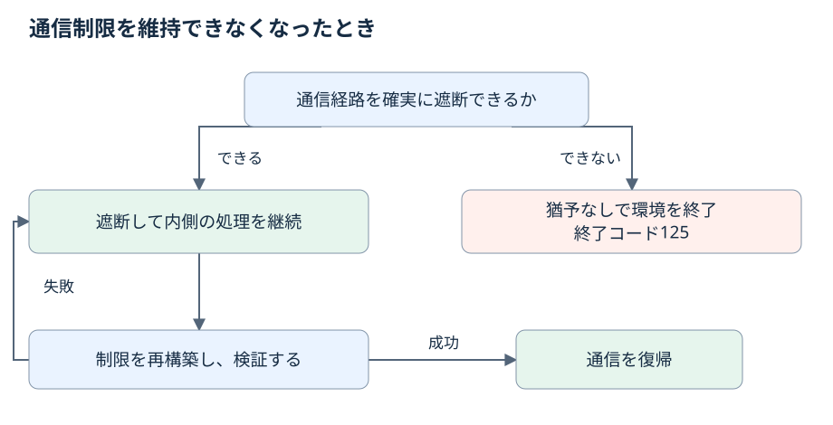

# filtered のプロセスの寿命と通信の障害

この章は、`filtered` モードで kakoi が主コマンドをどう見守り、どう終わらせるかを定める。
Ctrl+C や SIGTERM を受けたときの動き、終了猶予のキー、kakoi が返す終了コード、通信の制御に障害が起きたときの遮断と復帰、実行中の通知の出し方を扱う。
`host` と `none` の終了の仕方は [10-process.md](../10-process.md) を、モードそのものは [01-modes.md](01-modes.md) を読む。

この章の規則は草案である。
実装の前に、方式が実際に成り立つことを確かめる実証の条件（[library.md](../../maintainer/library.md)）を満たす必要がある。

## filtered で監督を残す
<!-- @kotowari[REQ-148:b91c1881, EX-328:8555ae9b, EX-329:0a499fe2] -->

`filtered` では、主コマンドの実行中も kakoi の**監督プロセス**が残る。
監督プロセスは、通信障害からの復帰と、主コマンドが終わった後の子プロセスの回収を受け持つ。

`host` と `none` では、kakoi は従来どおり bwrap へ exec して自分自身を置き換える。
監督を残すのは `filtered` だけで、bwrap へ exec する契約を改めたのもこのモードに限られる。

| モード | 起動後の kakoi |
|---|---|
| `filtered` | 監督プロセスとして残る |
| `host`、`none` | bwrap へ exec する（従来どおり） |

## 主コマンドが終了したとき
<!-- @kotowari[REQ-061:044ab5a8, REQ-062:db2a5071, EX-114:13d08ae8, EX-115:2a05a9d6, EX-116:24dbf6f8] -->

主コマンドが終了したら、隔離環境も終了する。
主コマンドが起動した子プロセスが残っていても、それを理由に環境を残さない。
主コマンドが起動したレビュー用のサービスが公開されたまま動いていても、そのサービスごと終了させ、公開ポートを片付ける。

終了は次の順で進む。

1. 公開と外部への通信を止める。
2. 残った子プロセスに終了を要求する。
3. 有限の猶予（終了猶予）を与える。
4. 猶予が過ぎても残っているプロセスを強制終了する。

猶予の長さは[終了猶予のキー](#終了猶予のキー)で、期限の数え方は[猶予の期限の数え方](#猶予の期限の数え方)で定める。

## 環境ごとに片付けるもの
<!-- @kotowari[REQ-060:5a66fb32, EX-112:944bffc0, EX-113:abc87200] -->

ネットワークの状態と補助処理は、隔離環境ごとに独立して管理する。
環境が終了すると、その環境の次の 3 つを片付ける。

- IP の許可
- 公開ポート
- 補助プロセス

片付けは終了した環境の分だけに及ぶ。
隔離環境 X と Y がそれぞれサービスを公開しているとき、X が終了しても Y の通信とサービスの公開は続く。

## 終了猶予のキー
<!-- @kotowari[REQ-095:4ba81b42, REQ-063:f724c1a8, EX-204:796e7960, EX-205:9241c032, EX-206:d762d25a] -->

終了猶予の長さは、ポリシーの `process` テーブルの `shutdown-grace-seconds` で指定する。

| キー | 型 | 既定値 | 範囲 | 効くモード |
|---|---|---|---|---|
| `process.shutdown-grace-seconds` | 整数（秒） | 5 | 1〜300 | `filtered` |

```toml
[network]
mode = "filtered"

[process]
shutdown-grace-seconds = 10
```

この例では終了猶予は 10 秒になる。
キーを省略すると 5 秒になる。

整数でない値（`1.5` のような小数）と、1〜300 の範囲外の値は入力エラーになり、起動しない。
このときの診断の種類と終了コードの一般則は [10-process.md](../10-process.md) による。

## 猶予が効くモード
<!-- @kotowari[REQ-096:0efe4e73, EX-207:04dcb599, EX-208:ba2d1427, EX-209:17f782e8] -->

終了猶予が効くのは `filtered` だけである。
`host` と `none` の終了の仕方は従来のまま変わらない。

`host` または `none` のポリシーに `process.shutdown-grace-seconds` が明示されていれば、kakoi はその値が使われないことを警告して起動する。
警告は `kakoi: warning:` で始まる行で、診断ではないため起動は止まらない。

| モード | `shutdown-grace-seconds` を書いたとき |
|---|---|
| `filtered` | 指定した秒数を終了猶予に使う |
| `host`、`none` | 使われない旨を警告し、従来の終了の仕方を保つ |

## 段の合成と検査
<!-- @kotowari[REQ-097:07fa270d, EX-210:2a6abe28, EX-211:71950ff7, EX-212:b3d9c7e6, EX-213:031a7bb8] -->

`process.shutdown-grace-seconds` は段ごとに書ける（段は[用語](../02-terms.md)を参照）。
合成は次のとおり。

- 上の段が値を明示していれば、その値が下の段の値を上書きする。
- 上の段が省略していれば、下の段の値を使う。
- どの段も省略していれば 5 秒になる。

下の段が 5 秒、上の段が 10 秒なら 10 秒になる。
下の段が 10 秒で、上の段に指定が無ければ 10 秒になる。

値の検査（整数であること、1〜300 の範囲に入ること）は、猶予が使われない `host` と `none` でも行う。
`mode = "host"` で `301` を書くと、起動前に入力エラーになる。

猶予を書いたポリシーでは、`network.mode` の明示が必須になる。
明示は同じ段でなくてもよく、別の段が明示した `mode` でも条件を満たす。
どの段も `mode` を明示せずに猶予を書くと、起動前にエラーになる。
`mode` の明示の規則は [01-modes.md](01-modes.md) を参照する。

## 猶予の期限の数え方
<!-- @kotowari[REQ-105:182e1694, EX-227:74d877bc, EX-228:c53c67ae, EX-229:4486f003] -->

終了猶予は、通信と公開を止めて最初の終了要求を送った時点から数え始める。
期限は主コマンドと子プロセスの全体で 1 本だけである。

期限は次のことでは延びない。

- 猶予の途中で主コマンドが終了した。5 秒の猶予を始めて 2 秒後に主コマンドが終われば、残る子プロセスの猶予は 3 秒である。
- 猶予の途中で新しい子プロセスが現れた。新しい子プロセスも既存の期限の対象になる。

主コマンドが先に終了していた場合も、数え始めは通信と公開を止めて子プロセスへ最初の終了要求を送った時点である。

## 全員が終了したら待たない
<!-- @kotowari[REQ-063:f724c1a8, EX-117:383b37a3, EX-118:67ee165d] -->

期限は残ったプロセス全体で共通で、プロセスの数だけ延びることはない。
子プロセスが 3 つ残っていても、猶予を指定していなければ全体で共通の 5 秒の期限を使う。

残ったプロセスがすべて終了したら、期限を待たずに片付ける。
猶予に 300 秒を指定していても、1 秒で全員が終了すれば残り 299 秒は待たない。

## 対話中の Ctrl+C
<!-- @kotowari[REQ-098:15da6880, EX-214:673d544c, EX-215:62a4d588] -->

`filtered` で主コマンドが対話中に利用者が Ctrl+C を押すと、割り込みはアプリ側へ届く。

- アプリが Ctrl+C を操作の取り消しとして扱い、実行を続けるなら、隔離環境も続く。
- 割り込みを受けた主コマンドが終了したら、[主コマンドが終了したとき](#主コマンドが終了したとき)の片付けを行う。

割り込みをアプリへ届ける具体的な方式は決まっていない（[open-issues.md](../../appendix/open-issues.md)）。

## 終了猶予中の Ctrl+C
<!-- @kotowari[REQ-099:e945727f, REQ-100:cecbb707, EX-216:1fd905dc, EX-217:c14b3319, EX-218:d5a54833] -->

主コマンドが終了した後の終了猶予中に Ctrl+C を押すと、残りの猶予を打ち切る。
kakoi は残った子プロセスを強制終了し、片付けを進める。
猶予が 200 秒残っていても、それを待たずに強制終了する。

猶予を打ち切っても、kakoi が返す終了コードは確定済みの主コマンドの終了コードのままである。
主コマンドが 0 で終わっていれば 0、7 で終わっていれば 7 を返す。
猶予を打ち切ったことは[通知](#通知の出力先)で知らせる。

## SIGTERM による終了
<!-- @kotowari[REQ-101:d449ba9d, EX-219:50e724e6, EX-220:06e18ac6] -->

`filtered` で外部から kakoi へ SIGTERM が届くと、隔離環境全体の終了処理に入る。

1. 通信と公開を止める。
2. 主コマンドと子プロセスに終了を要求する。
3. 指定した終了猶予が過ぎても残るプロセスを強制終了する。

終了要求に応じずに動き続ける主コマンドも、猶予が過ぎれば強制終了する。

## SIGTERM を受けたときの終了コード
<!-- @kotowari[REQ-102:edf4e0bf, EX-221:f23e1436, EX-222:cd41efa8] -->

主コマンドの実行中に SIGTERM を受けて終了処理を始めたら、kakoi は終了コード 143 を返す。
主コマンドが後処理を済ませて 0 で終わった場合も、猶予内に終わらず強制終了した場合も 143 になる。

ただし、[安全上の故障](#安全上の故障で-125-を優先する)に当たる場合は 125 が優先する。

## 重なって届く SIGTERM
<!-- @kotowari[REQ-103:13b5cf32, REQ-104:7aed30e2, EX-223:7127e910, EX-224:1f4b2ccb, EX-225:611fab85, EX-226:9a9c5d40] -->

SIGTERM で始めた終了猶予の途中で再び SIGTERM が届いても、最初の期限を保つ。
期限は延びも縮みもしない。
期限まで 3 秒残っていれば、再度の SIGTERM の後も残りは 3 秒で、再度の SIGTERM だけを理由に直ちに強制終了することはない。
何度 SIGTERM が届いても、最初の期限に達したら残ったプロセスを強制終了する。
主コマンドが終了した後であれば、Ctrl+C による猶予の打ち切りはこの間も使える。

主コマンドの終了を確認して子プロセスの終了猶予に入った後に SIGTERM が届いた場合は、次の 2 つを変えない。

- 確定済みの主コマンドの終了コード（0 なら 0、7 なら 7。143 にはならない）
- 既存の猶予の期限

## 安全上の故障で 125 を優先する
<!-- @kotowari[REQ-142:56c9e13c, EX-316:84706025, EX-317:484e7740] -->

**安全上の故障**は、通信制限を維持できず、通信の遮断も保証できない状態を指す。
安全上の故障で環境を終了するとき、kakoi は終了コード 125 を返し、原因を知らせる。
125 は、主コマンドの成功や失敗の終了コードよりも、SIGTERM による 143 よりも優先する。
SIGTERM による終了処理の途中でこの故障が起きても 125 になる。

通信制限を維持できている間の DNS の失敗は、安全上の故障ではない。
名前解決に失敗しても通信制限が保たれていれば、主コマンドが 0 で終わった結果を 125 に置き換えない。

## 終了コードの一覧
<!-- @kotowari[REQ-064:1e7a9027, EX-120:93747280, EX-121:ea465fc3] -->

`filtered` で kakoi が返す終了コードは次のとおり。

| 状況 | kakoi の終了コード |
|---|---|
| 通信制限を維持できず、遮断も保証できないために環境を終了した | 125（理由を知らせる） |
| 主コマンドの実行中に SIGTERM を受けて終了処理を始めた | 143 |
| 主コマンドの終了を確認した後に、Ctrl+C で猶予を打ち切った | 主コマンドの終了コード |
| 主コマンドの終了を確認した後に、SIGTERM が届いた | 主コマンドの終了コード |
| 通常の終了（通信制限を維持できている） | 主コマンドの終了コード |
| 名前解決に失敗したが通信制限は維持できている | 置き換えない（該当する他の行に従う） |
| 起動時に通信制限を準備できなかった | 起動エラー（終了コードは未決） |

125 は kakoi 自身の失敗として返す値で、表の他のどの行よりも優先する。
起動時の準備失敗の終了コードは決まっていない（[open-issues.md](../../appendix/open-issues.md)）。

## 起動時に通信制限を準備できないとき
<!-- @kotowari[REQ-057:f64381d1, EX-106:3fa22062] -->

起動時に要求された通信制限を準備できなければ、起動エラーにしてアプリを実行しない。
通信の無い状態での起動や、制限の無い通信への切り替えは、自動では行わない。

## 実行中に制限を維持できなくなったとき
<!-- @kotowari[REQ-058:bece9872, REQ-065:26b3ab37, EX-107:eb1786c3, EX-108:75a1b880, EX-122:cc2711f1] -->

起動した後に通信制限を維持できなくなったときは、通信を確実に遮断できるかどうかで動きが分かれる。



図の「遮断」は次の 3 つの経路をすべて止めることを指す。

- 外向きの通信
- ホスト側のサービスへの接続
- 待受の公開

| 遮断できるか | 動き |
|---|---|
| 3 つの経路を確実に遮断できる | 遮断して通知し、隔離環境の中の処理を続ける。続けて[復帰](#遮断したまま復帰する)を試す |
| 遮断を保証できない | 隔離環境を終了する。終了猶予を適用せず直ちに強制終了し、125 を返す |

遮断を保証できないときは、終了猶予に 300 秒を指定していても待たない。
許可していない経路を開いたまま処理を続けることになるためである。

## 遮断したまま復帰する
<!-- @kotowari[REQ-059:07f8e3cb, EX-109:b3ae9d7b, EX-110:ccdff67f, EX-111:219aa0ca] -->

障害で通信を遮断して処理を続けている間、kakoi は通信制限の再構築を試す。
再構築には起動時に確定したポリシーを使う。

- 制限が正常に働くと確認できるまで、遮断を保つ。
- 確認できたら、利用者の操作を待たずに通信を自動で戻し、復帰を知らせる。
- 障害の前に得た DNS の許可で、復帰の時点で期限が切れているものは、そのまま戻さない（DNS の許可の寿命は [04-dns.md](04-dns.md)）。

復帰で戻るのは通信の経路だけである。
障害で切れた接続を張り直すのはアプリの役割になる。

## 再試行の間隔と打ち切り
<!-- @kotowari[REQ-066:49ed7c48, REQ-143:7fc6deee, EX-124:6b673965, EX-125:88600ec6, EX-318:d6783ab3, EX-319:554b4719] -->

再構築の試行が失敗したら、待ってから次を試す。
待つ間も、試行の間も、遮断は保つ。
この再試行は、安全な遮断を維持できている間に限って行う。

| 条件 | 扱い |
|---|---|
| 1 回の試行の長さ | 既定 10 秒で打ち切る。1〜300 秒に変更できる |
| 失敗の後の待ち時間 | 1、2、4、8、16 秒の順に待ち、以後は毎回 30 秒 |
| 試行の重なり | 前の試行が終わるまで次を始めない |
| 再試行の回数 | 隔離環境が動いている間は上限なし |
| 復帰した後に再び故障したとき | 失敗の回数を数え直し、1 秒の待ち時間から始める |

試行の打ち切りの時間を変えるポリシーのキーは決まっていない（[open-issues.md](../../appendix/open-issues.md)）。

待ち時間が 30 秒まで伸びた後に復帰し、再び故障して最初の再構築に失敗したら、次の試行までの待ち時間は 1 秒になる。

## 復帰中の通知
<!-- @kotowari[REQ-067:3bbfc5d5, EX-126:6730eccd, EX-127:a0cfc787, EX-128:688597b9] -->

復帰を試している間、kakoi は次の 3 つを知らせる。

- 遮断を始めたこと
- 再構築の失敗の理由が変わったこと
- 復帰に成功したこと

同じ理由で失敗が続く間は、同じ通知を繰り返さない。
理由が同じかどうかの判定方法と、通知の詳しい書式は決まっていない（[open-issues.md](../../appendix/open-issues.md)）。

## 通知の出力先
<!-- @kotowari[REQ-068:5668b36e, EX-129:19cd823c, EX-130:96f3a38a] -->

実行中のネットワークの通知は、標準エラーへ 1 件 1 行で出す。
各行には kakoi の通知と分かる接頭辞が付く。

- 標準出力には通知を混ぜない。アプリの標準出力を別のコマンドへパイプで渡していても、通知は流れ込まない。
- 出力先はアプリの標準エラーと同じで、通知を受け取るための専用の設定は要らない。

## 出力が詰まったとき
<!-- @kotowari[REQ-069:df90cbdf, REQ-144:82c58659, EX-131:e8e87560, EX-132:87fef332, EX-320:233a7ebe, EX-321:be054220] -->

標準エラーの出力先が閉じていたり、読み手が止まっていたりしても、通信の制御は止まらない。
通知を書き出せるのを待たずに、通信制限、遮断、復帰、終了の処理を進める。
通信制限を維持できる限り、アプリも動き続ける。

その代わり、通知が失われることを許す。
書き出せない通知は次の上限まで保持する。

| 上限 | 値 |
|---|---|
| 件数 | 256 件 |
| 合計の大きさ | 1 MiB |

新しい通知を保持するとどちらかの上限を超えるときは、古い通知から捨てて両方の上限の内に収める。
出力先が回復したら、通知が欠けたことと現在の状態を優先して知らせる。
1 件の通知の最大の長さは決まっていない（[open-issues.md](../../appendix/open-issues.md)）。
