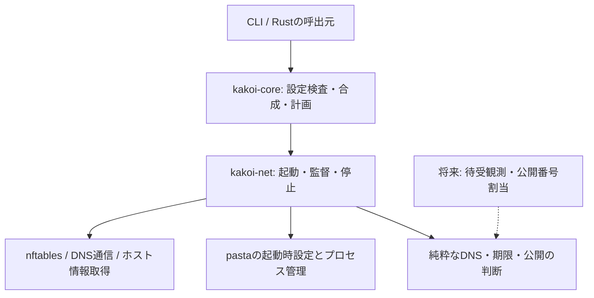

# kakoi-net初版の実装計画

状態: 2026-09-16にkemiで内容承認済み。実装は利用者指示によりメインセッションで行う。A161により初版の固定公開は同一IP系統へ限定する。

## 目標

pastaの通常の起動時設定で、外向き通信の制限と明示的な固定ポート公開を使えるfilteredモードを提供する。動的公開は後続の追加機能とする。

## 仕様と承認の扱い

正本の入口は `docs/spec/kakoi.md`。工程内で `network/` から始まる仕様パスおよび `proof-gate.md` 等の仕様ファイル名は `docs/spec/kakoi/` を基準とする。今回の初版範囲は `docs/spec/kakoi/network/initial-release.md` を参照し、各責務の仕様へ進む。検査用表現は `docs/ir/`。末尾の検証対応表に対象要求を列挙する。

既存の責務別仕様は会話で承認済みであり、未コミットだけを理由に壁打ちをやり直さない。今回の範囲改訂と計画はkemiで内容承認済み。計画の承認後、実装開始前に仕様・IR・判断記録・計画の対象バイトを固定する。検証が通った区切りごとに作業ブランチへコミットする。push・マージ・リリースは利用者の指示による。

## 方式と理由

pastaはRustライブラリとして組み込むものではなく、起動・監督する外部実行ファイルとして扱う。bwrapで隔離し、pastaで通信を運び、nftablesで許可・期限・故障時遮断を強制する。host/noneには追加依存を要求しない。

部品の採否は次のとおり。新しい依存の具体版は工程1で確定し、判断規則を通信ライブラリやOS操作へ埋め込まない。

| 責務 | 採用する部品・方針 | 理由 |
|---|---|---|
| 通信転送 | 上流未修正のpasta、起動時の明示設定 | 実験的な動的制御と自前TCP/IP実装を初版から外す |
| 許可と失効 | カーネルのnftablesとconntrack | ユーザー空間が停止しても有限期限を進められる |
| 隔離と子プロセス | 既存bwrap、Linuxの名前空間・FD・シグナル | 既存の隔離境界と終了規則を維持する |
| DNSワイヤ形式・IDNA・TLS | 維持されている既存Rust依存を工程1で選ぶ | 独自のパーサー・暗号処理を実装しない |
| 許可の採否・期限・公開計画 | kakoi側の純粋な判断処理 | ポリシー固有の規則を外部ツールから独立して検証する |
| 時間・ホスト情報・プロセス操作 | テストで使う差替え境界を設ける | 実時計の待機や実ホストの書換えなしで故障・競合を再現する |

### 将来の動的公開を足す場所

設定から作る公開の意図と、確保済みの公開先を別の値にする。初版は明示された対応から起動時設定を作る。将来は待受観測と番号割当が同じ公開の意図を作り、pasta用の操作部分へ追加・削除を依頼できる構造にする。

pestoのコマンド、制御ソケット、pastaの引数形式はnetの実行部分に閉じ込め、coreの設定型やDNSの判断処理へ漏らさない。固定公開の意味を将来の更新で動的公開へ読み替えない。将来用の空実装、使わない公開API、backend登録機構は作らない。時計・OS操作の差替えは同じ変更で必要とするテストを持つ。

## 変更範囲と実装順

`Cargo.toml` / `Cargo.lock`、`crates/kakoi-core/src/`、新設する `crates/kakoi-net/`、`src/`、`tests/kakoi_net.rs` と `tests/kakoi_net/`、既存の関係する回帰テスト、導入・利用文書が対象。既存core全体の純粋化や文章校正を混ぜない。既存coreには環境アクセスを行う処理もあるため、今回のネットワーク判断境界を純粋に保つことと、無関係な既存処理の移設を区別する。

工程1で初版方式の成立を確認してから製品コードへ進む。工程2→3→4、工程3→5→6を経て、工程7で固定公開、工程8で監督・終了を統合し、工程9でCLIと導入を仕上げ、工程10で提供前の確認を行う。各工程で必要なテストを先に失敗させ、実装後に通す。仕様の具体例をすべて一対一の重複テストへ変換せず、観測する挙動をまとめる。

## 工程1 — 初版に必要な依存と起動方式を確定する

- 目的・仕様: `docs/spec/kakoi/proof-gate.md` の「実装開始の条件」「依存と対応環境」。初版用の狭い実証を一回まとめ、以後の統合検証と区別する。
- 前提: 今回の範囲改訂が承認済み。TUN・user/network namespaceが使える対応候補ホストがある。
- 変更可: `tools/net-probes/`、既存の実証記録、依存版と対応環境の記録。製品Rustコードはまだ変更しない。
- 完了条件: 上流未修正pastaの入手可能な版で、公開なしの外向きTCP/UDP、ホスト接続、固定公開、起動前の遮断、初版で通る全経路の双方向遮断を確認。IPv4/IPv6の同一系統どうしを含める。固定UDPの同一peerによるサービス再起動と環境終了後のポート再利用を別に確認する。修正版の過去PASSは代用しない。標準パッケージで導入できるOS・版・必要な権限・最低依存版を記録する。
- 証拠: external — 対応ホストでrunnerを実行し、バイナリ由来・SHA・版・case別結果・回収・ホストnamespace不変が揃った報告を既存実証記録に追記する。ホストのネットワーク設定を変更せず、専用namespace内で測定する。DNS/IDNA/TLS依存はMSRV・保守状況・必要な未知RR保持/CA検証の適合を公式資料と小さい確認で記録する。
- 実装裁量: 測定fixtureの内部構成、同等の標準的Rust依存の選択。最初から全将来機能を検証しない。
- 停止条件: 初版にもpesto・限定修正版が必要、導入に未合意のホスト権限・保護設定変更が必要、または上記通信・遮断が成立しない。範囲を黙って縮小せず方式を再判断する。

## 工程2 — 設定を検査し、ネットワーク計画へ変換する

- 目的・仕様: `network/policy.md`「宛先と通信方式を許可する」「ポート番号と範囲の書き方」、`network/address.md`、`network/dns-input.md`、`network/host.md`、初版の固定公開契約。正確な節名は末尾の対応表に列挙する。
- 前提: 工程1完了。固定公開の入力形式が承認済み。
- 変更可: `crates/kakoi-core/src/{policy,layers,plan}.rs` と同責務の新モジュール、`src/plan_text.rs`、`src/plan_json.rs`、関係する既存テストと `tests/kakoi_net/`。
- 完了条件: IP/CIDR/DNS/host-loopback・ポート・モード・上書き/連結規則を一つの検査境界で扱う。host/noneで非使用の設定は構文だけ検査し、pasta探索やDNS照会をしない。計画表示でも通信を起動せず、実測していない公開成功を表示しない。
- 証拠: test — `config_boundaries`、`layer_merge_and_inactive_settings`、`plan_has_no_network_side_effects`。無効な設定、範囲の境界、未導入依存のhost/none、レイヤ間競合を実際の公開API/CLIから観測する。
- 実装裁量: 内部型・ファイル名・正規化後の表現。初版と将来の設定形式を曖昧に共用しない。
- 停止条件: 記載のない受理形式や設定競合の扱いが必要になる。

## 工程3 — kakoi-netと安全な起動・回収の土台を作る

A163により、未修正pastaを2段にして中間の制御用ネットワーク名前空間で故障時の遮断を行う。アプリ内部の同一公開ポートへの通信を維持する。追加実証では固定公開のみ確認済みのため、工程4以降で外向き・ホスト宛て経路、性能、製品統合を検証する。

- 目的・仕様: `network/library.md`「計画を作る処理と実際に通信する処理」、`network/recovery.md`「通信制限を準備してから起動する」「主コマンド終了後に片付けるもの」。
- 前提: 工程2完了。
- 変更可: workspace manifests、新設 `crates/kakoi-net/`、起動接続に必要な `src/startup.rs` / `src/main.rs`、`tests/kakoi_net*`。
- 完了条件: CLI外のRust呼出元から起動・監督・停止を使える。初期guardと必要な有限期限を用意してからアプリを起動する。アプリに制御FD・制御用名前空間・nft変更権限を渡さない。準備の各段階で失敗したら起動済み資源を回収する。他環境の資源を触らない。
- 証拠: test — `startup_failure_never_executes_app`、`app_cannot_change_network_control`、`two_environments_cleanup_independently`、`rust_caller_owns_session_lifecycle`。privilege境界は実プロセスと実namespaceで確認する。
- 実装裁量: 所有権を表す内部型、FDの受渡し、各準備段階の分割。全権限がある偽オブジェクトだけで境界検証を済ませない。
- 停止条件: アプリが親user namespaceの権限や制御FDへ到達する、準備完了前に通信が通る、ホスト側管理権限が増える。

## 工程4 — 静的許可と全経路の通信制限を実装する

- 目的・仕様: `network/policy.md`「宛先と通信方式を許可する」「起動後に許可が増える範囲」、`network/address.md`「扱うアドレスとlocalhost」「DNS名だけでは許可しない宛先」、`network/host.md`「ホストのlocalhostにつなぐ」「ホストのその他のIPにつなぐ」、`network/link-local.md`「接続先のインターフェースを指定する」「インターフェースが消えた場合」。
- 前提: 工程3完了。
- 変更可: netの判断・nft規則生成・pasta接続部分、ネットワーク計画の必要な型、`tests/kakoi_net/`。
- 完了条件: 外向き/ホスト宛て/隔離内を区別し、IP/CIDR・TCP/UDP・ポートの許可を強制する。直接転送を含む各経路の要求と一方的な返信を検査する。リンクローカルのinterface消失/再出現も許可済み範囲だけへ反映する。
- 証拠: test — `static_policy_covers_all_routes`、`unsolicited_traffic_obeys_guard`、`link_local_tracks_allowed_interface`。IPv4/IPv6・許可/拒否・内部通信継続を実ソケットで測り、古い宛先だけのguardが通らないことを確認する。
- 実装裁量: nftの集合・chain配置とバッチ生成。規則文字列の完全一致より実際の到達性を検証する。
- 停止条件: 未検査のpasta経路が見つかる、アプリの自己申告から許可が増える。

## 工程5 — DNS判断と許可期限を純粋な処理にする

- 目的・仕様: `network/dns-trust.md`「別名を辿り最終IPを検査する」「許可できないIPが応答に含まれる場合」、`network/dns-lifetime.md`「名前解決で得た許可が切れるまで」「TTLゼロの応答にも接続のための猶予を設ける」「期限が切れた後のTCPとUDP」、`network/dns-protocol.md`「読み取り照会の対応範囲」「失敗の種類と次の候補へ進む条件」、`network/dns-work-limits.md`「候補ごとの待ち時間と全体の期限」「別名を辿る深さ」「上流への問い合わせを数える」「IPv4とIPv6の予算を分ける」、`network/dns-capacity.md`「同じ問い合わせをまとめる」「同時に処理する解決数」「一つの解決を待つ問い合わせ数」。
- 前提: 工程3完了、工程1で選んだ依存を利用できる。
- 変更可: netのDNS判断・期限管理、`tests/kakoi_net/`、必要な依存宣言。
- 完了条件: 検査したA/AAAAだけがIP許可を増やす。CNAME・禁止範囲混在・TTLゼロ・既存TCP/UDP継続・未知RR・失敗応答・時間/件数上限を一つの状態遷移として検証できる。時計と応答を入力として扱う。
- 証拠: test — `dns_answer_validation`、`dns_expiry_and_zero_ttl`、`dns_limits_and_coalescing`。複数応答の並行到着、期限直前/直後、同じIPの独立した根拠、設定世代の変更を含める。
- 実装裁量: 内部の不変状態・時刻型・解析ライブラリの包み方。
- 停止条件: ライブラリが未知RRや必要な応答情報を保持できない、仕様のTTL/再送規則に矛盾が見つかる。

## 工程6 — DNS通信・ホスト追従・カーネル期限を接続する

- 目的・仕様: `network/dns-upstream-config.md`「ホストDNSを使うか問い合わせ先を書くか」「TLSの証明書を検証する」、`network/dns-host-settings.md`「起動時に引き継げない構成」「実行中にホストDNSが変わった場合」「新しい設定を取得できない場合」、`network/dns-lifetime.md`「名前解決で得た許可が切れるまで」、`network/dns-protocol.md`「上流との通信方式」。
- 前提: 工程4と5完了。
- 変更可: netのDNSトランスポート、ホスト情報取得、許可更新、`tests/kakoi_net/`。
- 完了条件: 通常DNSのUDP/TCP・DoT、CA検証、明示上流、実際の構成に一致するresolved proxyを扱う。単にresolvedが存在するだけで対応と判定しない。設定変更時のキャッシュ/処理中照会/全体上限を維持する。応答受信時刻からの期限を遅延したnft投入や復帰で延ばさず、応答返却前に必要な許可を有効化する。
- 証拠: test — `dns_proxy_wire_and_tls`、`host_dns_generation_change`、`delayed_rule_install_never_revives_expired_ip`、`failed_update_preserves_original_deadline`。専用DNS fixture・テストCA・private resolvedを使い、ホストのDNS設定は変更しない。期限下限の成功と過負荷時の安全な失敗を分ける。
- 実装裁量: DBus等の取得手段、通知とsnapshot再取得の組合せ、未参照集合の準備と切替。
- 停止条件: ホストの名前別DNS振分けを保持できないのに黙って単一上流へ切り替える必要がある、実際の到達性が期限を超える。

## 工程7 — 明示した固定ポートを公開する

- 目的・仕様: `network/initial-release.md`「固定公開」「公開する期間と失敗時の扱い」「重複・競合と設定の合成」。
- 前提: 工程4・6完了、D10/D11とA161の固定公開契約が承認済み。
- 変更可: netの公開計画・起動時pasta設定・実際の待受確保確認・回収、coreの対応型、`tests/kakoi_net/`。
- 完了条件: TCP/UDP・各familyの明示対応だけを起動前に確保し、localhost限定で通知する。内側サービス未起動でも対応を保持し、停止・再起動で番号を再選択しない。複数指定のうち一つでも競合した場合はアプリを起動せず部分確保を回収する。同一peerのUDP再接続と環境終了後の再利用を実測する。
- 証拠: test — `fixed_publish_lifetime`、`fixed_publish_conflict_prevents_launch`、`fixed_publish_partial_failure_prevents_launch`、`fixed_udp_service_restart_and_environment_reuse`。実際のsocket所有と到達性を観測し、pastaの終了値だけで成功を判定しない。
- 実装裁量: 公開要求と確保状態の内部型、実際の待受確認手段。pasta固有の操作は公開判断から分離する。
- 停止条件: 固定公開でもpestoや限定修正版が必須になる、内側待受の停止で公開用番号を解放してしまう、競合した既存ホストサービスへ干渉する。

## 工程8 — 故障・復帰・終了と通知を統合する

- 目的・仕様: `network/recovery.md`「実行中に制限を維持できなくなった場合」「遮断したまま復帰を試す」「主コマンド終了後に片付けるもの」、`network/process.md`「filteredで監督を続ける理由」「対話中と終了待ちのCtrl+C」「終了を待つ時間の指定」「外部から終了要求を受けた場合」「安全上の故障を終了結果へ反映する」、`network/notification.md`「通知を受け取る場所」「出力が詰まっても通信制御を続ける」。
- 前提: 工程4・6・7完了。
- 変更可: netの監督・状態遷移・通知・回収、必要なCLI起動接続、`tests/kakoi_net/`。
- 完了条件: 制御役/監視役/更新役の停止と終了、更新拒否・途中終了・応答喪失で許可を広げない。遮断可能な間は内部処理を維持して復帰し、不能なら125で猶予なく終了する。主コマンド終了時は公開と外向きを先に止めて共通猶予へ進む。Ctrl+C・TERM・終了コード優先・通知詰まりを合意どおり扱う。
- 証拠: test — `controller_monitor_and_renewer_faults`、`recovery_preserves_dns_deadlines`、`block_precedes_cleanup_grace`、`terminal_and_exit_priority`、`notification_backpressure_does_not_block_control`。実pastaの全初版経路で、要求/応答だけでなくサーバー発TCP/UDPも測る。コミット応答を失う場合は実状態の再確認か遮断へ進むことを確認する。
- 実装裁量: 有限生存期限と独立guardの具体構成、再構築手順、通知queue構造。
- 停止条件: 更新役が他の制御故障を無視して許可を延長し続ける、再構築で期限切れIPが復活する、通知停止で制御が止まる。

## 工程9 — CLI・計画表示・導入文書を完成させる

- 目的・仕様: `network.md`「7. ネットワーク」、`network/library.md`、`network/notification.md`、`runtime.md`、`documentation.md`。
- 前提: 工程8完了。
- 変更可: `src/`、workspace manifests、関係するcore接続部、`tests/`、`README.md`、導入例。バージョン/CHANGELOGはリリース作業の別承認で扱う。
- 完了条件: CLIとRustから同じ制限を利用できる。依存不足・未対応環境を実行前に説明する。公開先を通知してアプリ出力を改変しない。host/noneの起動・計画・既存終了結果を維持する。初版例は実験的機能や動的公開を要求しない。
- 証拠: test — `filtered_cli_and_rust_entrypoints`、`missing_dependency_diagnostic`、`host_none_regressions`、`printed_plan_matches_fixed_intent`。既存テストとCLIの実出力を確認し、依存なしhost/noneも実行する。
- 実装裁量: 既存診断形式内の具体的文言・内部関数名。
- 停止条件: 既存host/noneの追加依存や挙動変更が必要になる。

## 工程10 — 初版の提供条件を確認する

- 目的・仕様: `proof-gate.md`「提供前の条件」、`verification.md`、初版範囲と末尾の要求対応表。
- 前提: 工程1〜9完了。提供対象の標準導入環境で実行できる。
- 変更可: 実装範囲内の修正、`tests/`、実証記録、検証報告。承認済み仕様の意味変更はしない。
- 完了条件: 下記確認コマンドが通り、初版の対象要求に未検証がない。機構probeだけのPASSを製品テストへ読み替えない。pastaの標準導入版で、制限・固定公開・DNS・権限境界・故障/復帰/終了の統合を実行する。TUN不在は未検証であり成功ではない。
- 証拠: check — `cargo build --workspace --locked`、`cargo test --workspace --all-targets --locked`、`cargo fmt --all --check`、`cargo clippy --workspace --all-targets --locked -- -D warnings`、`kotowari check --format json`、`git diff --check`。kotowariの対象範囲の扱いは下記に従う。結果・OS・依存版・対象ソースを報告する。別コンテキストで品質と仕様適合をレビューし、REQ-150/391/392のようなreview要求も根拠付きで確認する。
- 実装裁量: 意味を変えない修正とテストの重複整理。
- 停止条件: 初版要求の検証が欠ける、標準導入版で成立しない、未対応の環境を対応済みと記載する必要が生じる。

## 検証対応表

各行に列挙した要求が今回の対象。複数工程に関係する要求は主な確認工程を示す。共通のcore既存仕様は回帰対象であり、新規実装対象を増やさない。

| IR文書と要求 | 主な工程 |
|---|---|
| `docs/ir/network/address/network-address-input.md#REQ-044`、`docs/ir/network/address/network-address-input.md#REQ-045`、`docs/ir/network/address/network-address-input.md#REQ-046`、`docs/ir/network/address/network-address-input.md#REQ-047` | 2・4 |
| `docs/ir/network/address/network-address-scope.md#REQ-030`、`docs/ir/network/address/network-address-scope.md#REQ-031`、`docs/ir/network/address/network-address-scope.md#REQ-032` | 2・4 |
| `docs/ir/network/address/network-address-syntax.md#REQ-048`、`docs/ir/network/address/network-address-syntax.md#REQ-049`、`docs/ir/network/address/network-address-syntax.md#REQ-050`、`docs/ir/network/address/network-address-syntax.md#REQ-051` | 2・4 |
| `docs/ir/network/policy/network-allow-config.md#REQ-088`、`docs/ir/network/policy/network-allow-config.md#REQ-092` | 2・4 |
| `docs/ir/network/policy/network-allow.md#REQ-001`、`docs/ir/network/policy/network-allow.md#REQ-002` | 2・4 |
| `docs/ir/network/dns-trust/network-dns-answer.md#REQ-019`、`docs/ir/network/dns-trust/network-dns-answer.md#REQ-020`、`docs/ir/network/dns-trust/network-dns-answer.md#REQ-021` | 5・6 |
| `docs/ir/network/dns-trust/network-dns-boundary.md#REQ-023`、`docs/ir/network/dns-trust/network-dns-boundary.md#REQ-024`、`docs/ir/network/dns-trust/network-dns-boundary.md#REQ-025` | 5・6 |
| `docs/ir/network/dns-upstream-config/network-dns-ca-trust.md#REQ-147` | 5・6 |
| `docs/ir/network/dns-work-limits/network-dns-cname-limit.md#REQ-119`、`docs/ir/network/dns-work-limits/network-dns-cname-limit.md#REQ-120` | 5・6 |
| `docs/ir/network/dns-capacity/network-dns-coalescing.md#REQ-127` | 5・6 |
| `docs/ir/network/dns-capacity/network-dns-concurrency.md#REQ-125`、`docs/ir/network/dns-capacity/network-dns-concurrency.md#REQ-126` | 5・6 |
| `docs/ir/network/dns-protocol/network-dns-error-response.md#REQ-123` | 5・6 |
| `docs/ir/network/dns-upstream-config/network-dns-explicit-upstream.md#REQ-111`、`docs/ir/network/dns-upstream-config/network-dns-explicit-upstream.md#REQ-112`、`docs/ir/network/dns-upstream-config/network-dns-explicit-upstream.md#REQ-113` | 5・6 |
| `docs/ir/network/dns-lifetime/network-dns-failure-cache.md#REQ-134`、`docs/ir/network/dns-lifetime/network-dns-failure-cache.md#REQ-135` | 5・6 |
| `docs/ir/network/dns-host-settings/network-dns-host-startup.md#REQ-145` | 5・6 |
| `docs/ir/network/dns-lifetime/network-dns-lifetime.md#REQ-014`、`docs/ir/network/dns-lifetime/network-dns-lifetime.md#REQ-015`、`docs/ir/network/dns-lifetime/network-dns-lifetime.md#REQ-016`、`docs/ir/network/dns-lifetime/network-dns-lifetime.md#REQ-017`、`docs/ir/network/dns-lifetime/network-dns-lifetime.md#REQ-018`、`docs/ir/network/dns-lifetime/network-dns-lifetime.md#REQ-022`、`docs/ir/network/dns-lifetime/network-dns-lifetime.md#REQ-389` | 5・6 |
| `docs/ir/network/dns-input/network-dns-pattern.md#REQ-003`、`docs/ir/network/dns-input/network-dns-pattern.md#REQ-004`、`docs/ir/network/dns-input/network-dns-pattern.md#REQ-010` | 5・6 |
| `docs/ir/network/dns-work-limits/network-dns-query-limit.md#REQ-121`、`docs/ir/network/dns-work-limits/network-dns-query-limit.md#REQ-122` | 5・6 |
| `docs/ir/network/dns-protocol/network-dns-record-scope.md#REQ-130` | 5・6 |
| `docs/ir/network/dns-lifetime/network-dns-refresh.md#REQ-133` | 5・6 |
| `docs/ir/network/dns-work-limits/network-dns-resolution-unit.md#REQ-124` | 5・6 |
| `docs/ir/network/dns-host-settings/network-dns-settings-change.md#REQ-107`、`docs/ir/network/dns-host-settings/network-dns-settings-change.md#REQ-108`、`docs/ir/network/dns-host-settings/network-dns-settings-change.md#REQ-109` | 5・6 |
| `docs/ir/network/dns-host-settings/network-dns-settings-failure.md#REQ-110` | 8 |
| `docs/ir/network/dns-upstream-config/network-dns-timeout-config.md#REQ-117`、`docs/ir/network/dns-upstream-config/network-dns-timeout-config.md#REQ-118` | 5・6 |
| `docs/ir/network/dns-work-limits/network-dns-timeout.md#REQ-116` | 5・6 |
| `docs/ir/network/dns-protocol/network-dns-transport.md#REQ-131`、`docs/ir/network/dns-protocol/network-dns-transport.md#REQ-132` | 5・6 |
| `docs/ir/network/dns-protocol/network-dns-unknown-record.md#REQ-149` | 5・6 |
| `docs/ir/network/dns-upstream-config/network-dns-upstream-config.md#REQ-146` | 5・6 |
| `docs/ir/network/dns-protocol/network-dns-upstream-response.md#REQ-114`、`docs/ir/network/dns-protocol/network-dns-upstream-response.md#REQ-115` | 5・6 |
| `docs/ir/network/dns-trust/network-dns-upstream.md#REQ-026`、`docs/ir/network/dns-trust/network-dns-upstream.md#REQ-027`、`docs/ir/network/dns-trust/network-dns-upstream.md#REQ-106` | 5・6 |
| `docs/ir/network/dns-capacity/network-dns-waiters.md#REQ-128`、`docs/ir/network/dns-capacity/network-dns-waiters.md#REQ-129` | 5・6 |
| `docs/ir/network/policy/network-empty-policy.md#REQ-085` | 2・4 |
| `docs/ir/network/recovery/network-failure.md#REQ-057`、`docs/ir/network/recovery/network-failure.md#REQ-058`、`docs/ir/network/recovery/network-failure.md#REQ-059`、`docs/ir/network/recovery/network-failure.md#REQ-064`、`docs/ir/network/recovery/network-failure.md#REQ-065` | 8 |
| `docs/ir/network/host/network-host-loopback.md#REQ-089`、`docs/ir/network/host/network-host-loopback.md#REQ-090`、`docs/ir/network/host/network-host-loopback.md#REQ-091` | 2・4 |
| `docs/ir/network/host/network-host-nonloopback.md#REQ-139` | 2・4 |
| `docs/ir/network/dns-input/network-idn.md#REQ-011`、`docs/ir/network/dns-input/network-idn.md#REQ-012`、`docs/ir/network/dns-input/network-idn.md#REQ-013` | 2・4 |
| `docs/ir/network/network-initial-release.md#REQ-390`、`docs/ir/network/network-initial-release.md#REQ-391`、`docs/ir/network/network-initial-release.md#REQ-392`、`docs/ir/network/network-initial-release.md#REQ-393`、`docs/ir/network/network-initial-release.md#REQ-394`、`docs/ir/network/network-initial-release.md#REQ-395` | 1・2・7・10 |
| `docs/ir/network/address/network-internal-address.md#REQ-043` | 2・4 |
| `docs/ir/network/network-library-boundary.md#REQ-150` | 3・9 |
| `docs/ir/network/link-local/network-link-local-wide-cidr.md#REQ-141` | 2・4 |
| `docs/ir/network/link-local/network-link-local.md#REQ-052`、`docs/ir/network/link-local/network-link-local.md#REQ-053` | 2・4 |
| `docs/ir/network/policy/network-mode-presence.md#REQ-087` | 2・4 |
| `docs/ir/network/policy/network-mode.md#REQ-082`、`docs/ir/network/policy/network-mode.md#REQ-083`、`docs/ir/network/policy/network-mode.md#REQ-084` | 2・4 |
| `docs/ir/network/notification/network-notification-buffer.md#REQ-144` | 8 |
| `docs/ir/network/notification/network-notification.md#REQ-068`、`docs/ir/network/notification/network-notification.md#REQ-069` | 8 |
| `docs/ir/network/recovery/network-ownership.md#REQ-060`、`docs/ir/network/recovery/network-ownership.md#REQ-061`、`docs/ir/network/recovery/network-ownership.md#REQ-062`、`docs/ir/network/recovery/network-ownership.md#REQ-063` | 8 |
| `docs/ir/network/policy/network-policy-authority.md#REQ-028`、`docs/ir/network/policy/network-policy-authority.md#REQ-029` | 2・4 |
| `docs/ir/network/policy/network-ports.md#REQ-005`、`docs/ir/network/policy/network-ports.md#REQ-006`、`docs/ir/network/policy/network-ports.md#REQ-007`、`docs/ir/network/policy/network-ports.md#REQ-008`、`docs/ir/network/policy/network-ports.md#REQ-009` | 2・4 |
| `docs/ir/network/recovery/network-recovery-attempt.md#REQ-143` | 8 |
| `docs/ir/network/recovery/network-recovery.md#REQ-066`、`docs/ir/network/recovery/network-recovery.md#REQ-067` | 8 |
| `docs/ir/network/address/network-special-address-policy.md#REQ-140` | 2・4 |
| `docs/ir/network/dns-lifetime/network-udp-settings.md#REQ-093`、`docs/ir/network/dns-lifetime/network-udp-settings.md#REQ-094` | 2・4 |
| `docs/ir/network/process/process-filtered-supervision.md#REQ-148` | 8 |
| `docs/ir/network/process/process-interrupt.md#REQ-098`、`docs/ir/network/process/process-interrupt.md#REQ-099`、`docs/ir/network/process/process-interrupt.md#REQ-100` | 8 |
| `docs/ir/network/process/process-safety-exit-priority.md#REQ-142` | 8 |
| `docs/ir/network/process/process-shutdown-config.md#REQ-095`、`docs/ir/network/process/process-shutdown-config.md#REQ-096`、`docs/ir/network/process/process-shutdown-config.md#REQ-097` | 8 |
| `docs/ir/network/process/process-shutdown-deadline.md#REQ-105` | 8 |
| `docs/ir/network/process/process-termination.md#REQ-101`、`docs/ir/network/process/process-termination.md#REQ-102`、`docs/ir/network/process/process-termination.md#REQ-103`、`docs/ir/network/process/process-termination.md#REQ-104` | 8 |

後続へ分ける要求（初版の合格判定から除外するが、削除・検証済み扱いにしない）:

- `docs/ir/network/link-local/network-link-local.md#REQ-054`（A167により初版は `host-interface` を起動前に拒否するため観測できない。2026-09-24に利用者の承認で移した。次の2件も同じ）
- `docs/ir/network/link-local/network-link-local.md#REQ-055`
- `docs/ir/network/link-local/network-link-local.md#REQ-056`
- `docs/ir/network/policy/network-inactive-validation.md#REQ-086`
- `docs/ir/network/publish-config/network-publish-address-selection.md#REQ-136`
- `docs/ir/network/publish-config/network-publish-address-selection.md#REQ-137`
- `docs/ir/network/publish-config/network-publish-config.md#REQ-079`
- `docs/ir/network/publish-config/network-publish-config.md#REQ-080`
- `docs/ir/network/publish-config/network-publish-config.md#REQ-081`
- `docs/ir/network/publish-target/network-publish-endpoint-notification.md#REQ-138`
- `docs/ir/network/publish-config/network-publish-family.md#REQ-072`
- `docs/ir/network/publish-config/network-publish-family.md#REQ-073`
- `docs/ir/network/publish-config/network-publish-family.md#REQ-074`
- `docs/ir/network/publish-lifetime/network-publish-lifecycle.md#REQ-037`
- `docs/ir/network/publish-lifetime/network-publish-lifecycle.md#REQ-038`
- `docs/ir/network/publish-lifetime/network-publish-lifecycle.md#REQ-039`
- `docs/ir/network/publish-lifetime/network-publish-lifecycle.md#REQ-071`
- `docs/ir/network/publish-lifetime/network-publish-recovery.md#REQ-070`
- `docs/ir/network/publish-lifetime/network-publish-release.md#REQ-078`
- `docs/ir/network/publish-target/network-publish-target.md#REQ-075`
- `docs/ir/network/publish-target/network-publish-target.md#REQ-076`
- `docs/ir/network/publish-target/network-publish-target.md#REQ-077`
- `docs/ir/network/publish-lifetime/network-publish-udp.md#REQ-040`
- `docs/ir/network/publish-lifetime/network-publish-udp.md#REQ-041`
- `docs/ir/network/publish-lifetime/network-publish-udp.md#REQ-042`
- `docs/ir/network/publish-target/network-publish.md#REQ-033`
- `docs/ir/network/publish-target/network-publish.md#REQ-034`
- `docs/ir/network/publish-target/network-publish.md#REQ-035`
- `docs/ir/network/publish-target/network-publish.md#REQ-036`

初版の合格判定から外す具体例（2026-09-24に利用者が承認。削除・検証済み扱いにしない）:

- `docs/ir/network/link-local/network-link-local-wide-cidr.md` のEX-315: 接続口付きの許可を使う例で、初版はA167によりそれを起動前に拒否する。REQ-054〜056と同じく後続で確かめる。
- `docs/ir/network/dns-work-limits/network-dns-query-limit.md` のEX-271: kakoiはDNSのUDPを自分で再送せず、TCPの再送はカーネルの中で起きるので、試験から観測できない。
- `docs/ir/network/dns-capacity/network-dns-coalescing.md` のEX-290: 解決条件が同じなら名前も同じなので、許可されない問い合わせが進行中の解決に合流する前提を作れない。許可の確認が合流より先にあることは実装の順序で保たれている。

## kotowariと既存の未対応テスト

テスト配置は `tests/kakoi_net.rs` と `tests/kakoi_net/`。現行 `.kotowari/config.yaml` の `tests/*.rs` / `tests/**/*.rs` に含める。各テストには実際に検証した要求の印だけを置き、製品のテストでないPython probeへ対応済み印を付けない。

後続の動的公開IRも履歴・設計として保持するため、全IRを対象とするkotowari 0.1.0の終了コード0を初版だけで保証することはできない。初版対象IDのrequirement_without_test、すべてのIR構文/出典エラー、新規テストの印の誤りを0にする。既存本体の未解決事項と後続要求はID・理由・今回前後の件数を別に報告し、全体PASSとは言わない。終了コード2は停止する。無関係な本体の挙動変更や、未実装要求をreviewへ変更することで指摘を消さない。この範囲運用は計画レビューで承認済み。

2026-09-24、kotowariの仕様改訂（IRの見出し・項目名の英語化、具体例への印の要求、review要求のhow_to_verify必須化）に追従した。初版対象の要求を`@about`に持つ具体例のscenario_without_testも上記の0にする対象へ含める。本体既存テストの具体例への対応付けとhow_to_verifyの記入は別作業とし、件数を別に報告する。

## 実装裁量と停止条件

具体的な関数名・内部型・同責務内のファイル分割は実装者へ委ねる。受理する入力、既定値、失敗時の挙動、追加権限、永続化、初版機能の削除は委ねない。1ファイルの行数だけを理由に同じ責務を分散しない。

意味の欠落・仕様との不一致、ホストを危険にさらす操作、影響の拡散、方式を変えても進展しない失敗は停止して報告する。未実装なら当該工程の実装を進め、完了証拠が揃ってから次へ進む。未実装であることだけを理由に要件インタビューをやり直さない。

## 対象外

pestoの初版利用、動的公開の自動検出・番号選択・削除/再利用、pastaの継続fork配布、通信スタックの自作、ホストネットワークの常設変更、将来のマルチキャスト/ブロードキャスト、無関係な本体仕様の校正、push・公開・リリース。
