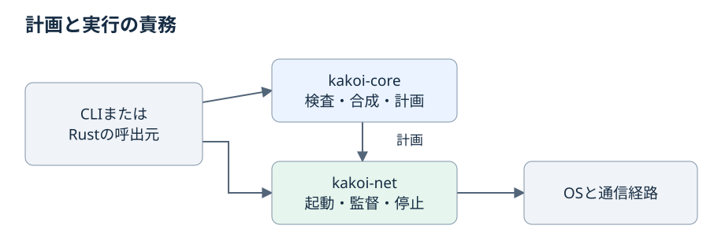

# ライブラリの責務

草案。実装前に[実証の完了条件](../proof-gate.md)を満たす必要がある。

Rustプログラムからも通信管理を利用できるように、設定から計画を作る責務と、その計画に従って環境を動かす責務を分ける。

## 計画を作る処理と実際に通信する処理

この図は呼出しの責務を示す。新しい関数名や型を公開APIとして確定するものではない。DNS応答を採用するか、許可が期限切れかという判断は、OS操作をせずに検証できるようにする。

kakoi-coreは設定の検査・合成・計画を担当し、環境へ直接アクセスしない。kakoi-netが通信の起動・監督・停止を担い、CLI以外のRustプログラムからも使える形にする。DNS応答の採否や許可期限の判断はOS操作と分けて検証できる構造にする。

## 関連文書

[ネットワーク仕様の入口](README.md) · [要求・反例との対応表](../../../decision/brainstorm/2026-09-16-kakoi-net-spec-map.md)
